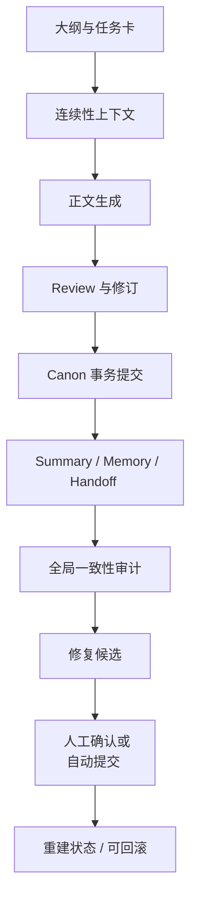
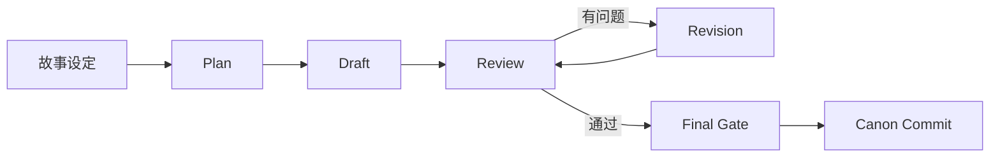
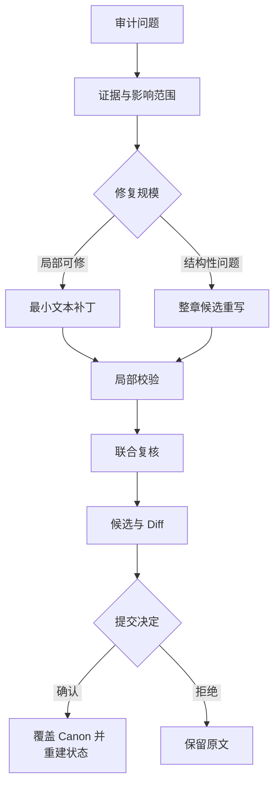

# NovelAgent

[English](README_EN.md) · [架构说明](docs/ARCHITECTURE.md) · [完整使用说明](docs/USAGE.md) · [安全说明](SECURITY.md)

**面向中文长篇网文的、可继承、可审查、可修正、可回滚的本地 AI 写作工作台。**

NovelAgent 不只是把“大纲 + 前文”交给模型续写。它把长篇生产拆成规划、写作、审查、修订、Canon 提交、记忆更新、全局审计和回滚等相互衔接的阶段，重点解决写到几十章、几百章后常见的时间线、人物状态、知识边界、物品归属和历史事件遗忘问题。

> **当前定位：有人监督的长篇写作工作台。** 现阶段适合让作者控制大纲、检查候选和决定提交，不建议完全无人值守地连续生成整部长篇。

## 它解决什么问题

普通续写流程往往只有“读取上下文 → 生成下一章”，上下文变长后就会发生遗忘、相互矛盾和错误累积。NovelAgent 增加了结构化状态、质量门和修复闭环：



它最有价值的地方不一定是“单次写得比最强模型更好”，而是让长期生产过程能够持续继承、定位问题、安全修正，并在修错时退回上一版。

## 核心能力

- Plan、Draft、Review、Revision、Summary、Memory 多阶段 Canon 流程
- SQLite 长期记忆、全文检索和可选向量检索
- 章节边界 Handoff、原文末尾保护和结构化 Canon 账本
- 模型审查与本地确定性规则共同参与的最终质量门
- 跨章节一致性审计、最小补丁、整章重写和联合复核
- 候选 diff、人工确认、强制提交、归档和哈希防漂移
- 正文、摘要、记忆、交接与状态快照的事务式提交
- DeepSeek、火山 Agent Plan、xAI 等模型路由及费用记录
- 外部 Canon 章节包导入、读者版分段和章节导出
- 本地登录、同源校验与 Windows DPAPI 密钥保存

## 运行方式

### 1. 记忆库如何工作

NovelAgent 不把所有历史正文无限堆进 Prompt，而是把不同用途的信息分层保存：

| 上下文层 | 主要内容 | 作用 |
| --- | --- | --- |
| `Outline` | 未来剧情、章节目标、必须发生与禁止提前发生的事件 | 控制故事方向 |
| `Summary` | 已完成章节的压缩历史 | 低成本回顾较长历史 |
| `Memory` | 人物、关系、物品、地点、知识、伏笔和状态变化 | 长期检索与状态继承 |
| `Handoff` | 上一章结尾的时间、地点、在场人物、未完成动作与下一章入口 | 防止章节交界处跳变 |
| 原文末尾 | 上一章最后一段实际正文 | 弥补摘要漏掉的具体动作和措辞 |
| Canon 账本 | 当前有效的数字、物品归属、人物知识和已生效决定 | 提供可确定校验的事实 |

长期记忆存入 SQLite。检索时先结合章节范围、实体和全文搜索筛选；配置本地 embedding 服务后，还会使用向量相似度补充语义召回。检索出的内容按上下文预算裁剪，但 Handoff、Canon 账本等关键连续性字段受到保护，不会像普通背景材料一样被直接删掉。

记忆层不是绝对真相：Summary、Memory 和 Handoff 中有一部分由模型提取，因此它们仍可能产生提取错误。系统通过结构化字段、提交校验、状态快照和全局审计降低污染风险，作者仍应检查关键转折。

### 2. 一章是怎么写出来的



1. **准备输入**：读取本章大纲、相关故事设定、最近正文、检索记忆、上一章 Handoff 和当前 Canon 账本。
2. **Plan**：先确定本章进入状态、主要变化、结束切点和要带入下一章的状态，限制模型随意另开主线。
3. **Draft**：根据计划写正文，同时遵守人物知识边界、当前物品与地点状态等约束。
4. **Review**：检查剧情漂移、连续性、人物、知识、世界规则、重复、风格和章节逻辑。
5. **Revision**：存在阻断问题时按指令修改；修订结果必须再次接受审查，不能绕过质量门直接覆盖正文。
6. **Canon 提交**：正文通过后，再统一生成并提交 Summary、Memory、Handoff 和状态快照。

### 3. 它怎么审查

审查不是只有一句“这章有没有问题”，而是两类检查合并：

| 检查方式 | 擅长发现的内容 |
| --- | --- |
| 确定性规则 | 数字冲突、物品持有人冲突、人物知识倒退、未标记地点跳转、缺失文件、提交状态不一致 |
| 模型 Review | 人物动机、逻辑跳跃、剧情漂移、未来信息泄露、场景重复、语言与节奏问题 |

Review 输出结构化严重程度、问题类型、证据和修订要求。明显硬错误会阻止提交；较轻问题可以作为建议保留。修订后还要经过 Final Gate，防止“修好一个问题，又引入另一个问题”。

跨章节审计会按重叠窗口读取更大范围，重点检查：

- 时间、日期、年龄、次数与比分等数字事实
- 人物位置、关系、能力、伤势和当前状态
- 物品的获得、转移、消耗、销毁与归属
- 某个角色在当时是否已经知道某条信息
- 已完成事件被重复执行，或未完成事件被无故遗忘
- 相邻或近期章节重复使用相同场景模板

### 4. 它怎么修复



- 审计结果先整理为带证据的问题包，并判断可能影响的章节范围。
- 小问题优先采用精确文本补丁，避免为改一句话而重写整章。
- 结构性矛盾可以生成整章候选，但不会默认直接覆盖 Canon。
- 候选经过局部校验与联合复核后，在界面中展示 diff。
- 作者可确认、拒绝或强制提交；强制提交适用于作者明确接受模型仍有异议的情况。
- 提交修复时同步更新正文、摘要、Handoff、Memory 与状态投影。
- 原版本进入归档，并记录哈希。若提交后又被人工修改，回滚会检测内容漂移，避免静默覆盖新改动。

修复早期章节后，后续章节已经形成的理解不一定会自动完全改变。因此，对影响人物关系、知识或长期主线的修改，仍建议扩大关联范围重新审计。

## 优点与不足

### 主要优点

- 写作、审查、纠错和记忆更新形成闭环，修复后的版本能被后续章节继承。
- Outline、Summary、Memory、Handoff 和原文末尾分工明确，避免只依赖一种摘要。
- 关键连续性字段受保护，普通上下文裁剪不会把它们一起删除。
- 正文必须经过结构化 Review、必要修订和最终质量门才能成为 Canon。
- 正文、摘要、记忆、交接与状态快照尽量保持同一版本，失败时不会只写一半。
- 全局审计针对长篇最容易暴露的时间、物品、知识和关系错误。
- 支持最小补丁、整章重写、联合复核、候选确认和强制提交，作者保留最终控制权。
- 哈希、事务、归档、回滚和重复提交保护让长期项目更安全。
- 模型路由、Thinking、Token、成本与日志可观察，便于定位问题。

### 当前不足

- 系统较重。在实际长篇测试中，单章 Review 曾接近 `79K tokens`；复杂配置下速度、费用和超时风险都较高。
- 候选生成和正式提交之间可能出现重复 Review，安全性更高但效率较低。
- 写作、复核和摘要若使用同一模型体系，错误会存在相关性，模型可能把自己的错误解释成合理。
- Summary、Memory 和 Handoff 仍可能提取错误，并把错误带入后续上下文。
- 修复前面章节后，后续已生成内容不一定全部重新理解，需要关联范围复审。
- 连续性检测仍会混入误报或证据不足项，目前检测稳定性弱于修复能力。
- 系统更擅长遵守设定和避免硬错误，不等于天然擅长爽点、悬念、人物张力和语言风格。
- 流程状态较多，异常重试时仍可能出现假卡住或页面残留最后阶段状态。
- 运行数据与程序目录尚未彻底解耦，升级或覆盖文件前必须备份工作数据。

### 当前版本自评

以下评分是基于实际长篇使用体验的工程自评，不是标准化模型基准：

| 维度 | 评价 |
| --- | ---: |
| 流程架构 | 7/10 |
| 长篇连续性设计 | 6.5/10 |
| 正文生产能力 | 6/10 |
| 自动审查可靠性 | 5/10 |
| 自动修复能力 | 6.5/10 |
| 数据安全与回滚 | 7/10 |
| 运行效率 | 4/10 |
| 无人值守能力 | 4.5/10 |
| **综合** | **6/10** |

## 快速开始

需要 Python 3.10 或更高版本。Windows 是主要运行平台；Linux/macOS 可以运行 Web 与核心流程，但 API Key 需要通过环境变量提供。

```powershell
git clone <your-repository-url>
cd NovelAgent
python -m venv .venv
.\.venv\Scripts\Activate.ps1
python -m pip install -r requirements.txt
Copy-Item config.example.json config.json
python app.py
```

打开 `http://127.0.0.1:7860`，首次访问设置管理员用户名和至少 8 位密码。然后配置 DeepSeek API；可选 DLC 扩写需要单独配置 xAI API。

生成前请先替换：

- `story/premise.md`：作品前提与核心矛盾
- `story/world.md`：世界规则
- `story/characters_seed.md`：人物初始设定
- `story/outline.md`：章节大纲
- `story/style.md`：语言、视角和禁用项

Embedding 服务默认不自动启动。要使用向量记忆，请在 `config.json` 中填写 `llama-server` 与 GGUF embedding 模型路径，并启用 `embedding_server.auto_start`。没有 embedding 服务时，数据库和全文检索仍可运行，但语义召回能力会下降。

完整配置、日常工作流和故障排查见[使用说明](docs/USAGE.md)。模块边界与数据流见[架构说明](docs/ARCHITECTURE.md)。

## 数据与发布安全

公开版不包含原作者的正文、人物设定、记忆数据库、账号凭据、运行日志、个人网络地址或硬件监控/功耗控制代码。`story/` 中只有可替换示例。

- 不要提交 `config.json`、`.env`、`runtime/`、数据库、日志或真实故事数据。
- Windows 使用当前用户的 DPAPI 加密 API Key。
- Linux/macOS 使用 `DEEPSEEK_API_KEY`、`XAI_API_KEY` 等环境变量；程序不会把 Base64 当作加密后落盘。
- 默认只监听 `127.0.0.1`。暴露到局域网或公网前，请增加 HTTPS、反向代理和访问控制。
- 覆盖升级前备份小说数据、报告、候选和归档；程序文件与运行数据尚未完全分离。
- 提示词中的题材相关表述已泛化为中性词；如果你的作品是特定题材，可参照[题材词模板](docs/GENRE_TEMPLATE.md)自行替换。

## 测试

```powershell
python -m pip install -r requirements-dev.txt
python -m pytest -q
```

当前公开测试集：`500 passed`。

## 项目状态

NovelAgent 是一个持续迭代的个人工程项目，目前没有承诺 API 稳定性。建议先在副本中测试新版本，再迁移正在创作的长篇项目。

## AI 生成声明

本项目代码大部分由 GPT-5.6-sol 生成。使用前请自行审查 AI 生成代码可能存在的局限。

## 许可证

本项目采用 [GNU General Public License v3.0](LICENSE)（SPDX: `GPL-3.0-only`）。你可以自由使用、修改和分发，但衍生作品必须以相同的 GPL-3.0 许可证开源。
