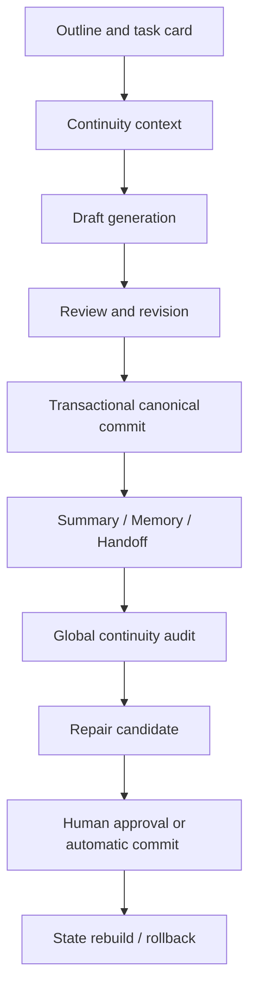
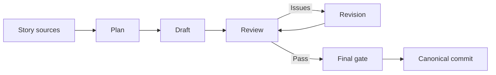
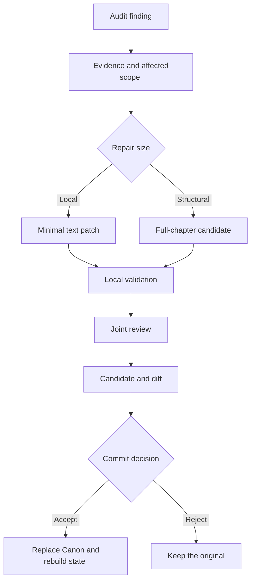

# NovelAgent

[中文](README.md) · [Architecture](docs/ARCHITECTURE_EN.md) · [User guide](docs/USAGE_EN.md) · [Security](SECURITY.md)

**A local AI writing workspace that makes long-form Chinese fiction inheritable, reviewable, repairable, and reversible.**

NovelAgent does more than send an outline and previous chapters to a model. It connects planning, drafting, review, revision, canonical commits, memory updates, global audits, repairs, and rollback into one production pipeline. Its main goal is to reduce timeline drift, forgotten character states, knowledge-boundary errors, item inconsistencies, and accumulated contradictions across hundreds of chapters.

> **Current positioning: a supervised long-form writing workspace.** Authors should still control the outline, inspect candidates, and decide what becomes canonical. Fully unattended book-length generation is not recommended yet.

## The problem it addresses

A basic continuation workflow is usually just “load context → write the next chapter.” As the manuscript grows, context is compressed or dropped, and small mistakes become permanent history. NovelAgent adds structured state, quality gates, and a repair loop:



Its primary value is not necessarily better prose in a single generation. It makes a long-running production process easier to inherit, inspect, correct, and roll back safely.

## Highlights

- Plan, Draft, Review, Revision, Summary, and Memory stages
- SQLite long-term memory, full-text search, and optional vector retrieval
- Chapter-boundary handoffs, protected source tails, and a structured canonical ledger
- A final quality gate combining model review with deterministic checks
- Cross-chapter audits, minimal patches, full rewrites, and joint validation
- Candidate diffs, manual approval, force commit, archives, and hash-based drift protection
- Transactional updates across prose, summaries, memories, handoffs, and state snapshots
- Model routing and usage tracking for DeepSeek, Volcengine Agent Plan, xAI, and compatible services
- External canonical chapter import, reader reflow, and chapter export
- Local authentication, same-origin checks, and Windows DPAPI secret storage

## How it works

### 1. The memory system

NovelAgent does not keep appending every previous chapter to the prompt. It stores information in layers with different responsibilities:

| Context layer | Contents | Purpose |
| --- | --- | --- |
| `Outline` | Future events, chapter goals, required events, and future boundaries | Controls story direction |
| `Summary` | Compressed history of completed chapters | Recalls long history at a lower token cost |
| `Memory` | Characters, relationships, items, locations, knowledge, hooks, and state changes | Long-term retrieval and state inheritance |
| `Handoff` | Previous chapter's ending time, location, cast, unfinished actions, and next entry point | Prevents boundary discontinuities |
| Source tail | The actual final passage of the previous chapter | Recovers concrete actions omitted by summaries |
| Canonical ledger | Current numeric facts, item ownership, character knowledge, and active decisions | Supports deterministic validation |

Long-term memory is stored in SQLite. Retrieval combines chapter scope, entity filters, and full-text search. When a local embedding service is configured, vector similarity adds semantic recall. Results are trimmed to a context budget, while critical continuity records such as handoffs and the canonical ledger are protected from ordinary trimming.

The memory layer is not an infallible source of truth. Some summaries, memories, and handoffs are extracted by a model and can be wrong. Structured schemas, commit verification, snapshots, and global audits reduce the risk, but authors should still inspect major turning points.

### 2. How a chapter is written



1. **Prepare context:** load the chapter outline, story sources, recent prose, retrieved memories, previous handoff, and the current canonical ledger.
2. **Plan:** define the entry state, required chapter change, ending cut point, and carry-out state before prose is written.
3. **Draft:** write the chapter while respecting character knowledge, item ownership, location, and other active constraints.
4. **Review:** inspect plot drift, continuity, character behavior, knowledge, world rules, repetition, style, and chapter logic.
5. **Revision:** address blocking findings. Revised prose must pass review again and cannot bypass the quality gate.
6. **Canonical commit:** once approved, commit the prose together with its summary, memory updates, handoff, and state snapshot.

### 3. How review works

Two complementary forms of checking are merged:

| Method | Best suited for |
| --- | --- |
| Deterministic checks | Numeric conflicts, item ownership, knowledge regression, unmarked location jumps, missing files, and inconsistent commit state |
| Model review | Motivation, logic gaps, plot drift, future leakage, scene repetition, prose, and pacing |

The review produces structured severity, issue categories, evidence, and revision instructions. Clear factual blockers prevent a canonical commit; lighter findings can remain advisory. Revised prose passes through a final gate so that fixing one issue does not silently introduce another.

The cross-chapter audit reads overlapping windows and focuses on:

- Time, dates, ages, counts, scores, and other numeric facts
- Character location, relationships, abilities, injuries, and active state
- Item acquisition, transfer, consumption, destruction, and ownership
- Whether a character should know a fact at a given point
- Completed events repeated as new, or unresolved events silently forgotten
- Reuse of the same scene template across nearby chapters

### 4. How repair works



- Audit findings become evidence-backed issue packets with an estimated affected range.
- Small errors prefer exact text patches instead of rewriting an entire chapter.
- Structural contradictions can produce a full-chapter candidate, but it does not overwrite canonical prose by default.
- Candidates receive local validation and joint review, then appear with a diff.
- The author can accept, reject, or force a commit when a model objection is understood and intentionally waived.
- A repair commit updates prose, summaries, handoffs, memory, and projected state together.
- The old version is archived and hashed. Rollback detects later manual edits to avoid silently overwriting newer work.

When an early chapter changes, downstream summaries and interpretations may not all be fully reconstructed automatically. Relationship, knowledge, and long-running plot changes should therefore trigger a wider audit.

## Strengths and limitations

### Strengths

- Writing, review, repair, and memory updates form one loop; later chapters inherit accepted repairs.
- Outline, Summary, Memory, Handoff, and source tail have distinct roles instead of relying on one summary.
- Critical continuity fields survive ordinary context trimming.
- Prose must pass structured review, revision when necessary, and a final quality gate before becoming canonical.
- Prose, summaries, memories, handoffs, and state snapshots remain aligned as closely as possible.
- The global audit targets the timeline, item, knowledge, and relationship errors most visible to long-form readers.
- Minimal patches, full rewrites, joint validation, candidate approval, and force commit preserve author control.
- Hashes, transactions, archives, rollback, and duplicate-commit protection improve engineering safety.
- Routing, thinking mode, tokens, cost, and logs remain observable.

### Current limitations

- The pipeline is heavy. In one long-form production configuration, a single chapter review approached `79K tokens`, increasing cost, latency, and timeout risk.
- Candidate creation and final submission may repeat some review work.
- If drafting, review, and summarization use the same model family, their errors can be correlated.
- Model-extracted summaries, memories, and handoffs can still introduce memory pollution.
- Repairing an earlier chapter does not guarantee that every downstream interpretation is reconstructed.
- Continuity detection still mixes real problems, weakly supported findings, and false positives. Detection is currently less reliable than repair.
- The system is better at respecting constraints than automatically producing pacing, suspense, character tension, or a distinctive prose style.
- Many interacting states make retries, apparent stalls, and stale UI status possible.
- Program files and working data are not yet fully separated, so upgrades require careful backups.

### Current self-assessment

These scores summarize practical long-form use and are not a standardized model benchmark:

| Dimension | Score |
| --- | ---: |
| Pipeline architecture | 7/10 |
| Long-form continuity design | 6.5/10 |
| Prose generation | 6/10 |
| Automated review reliability | 5/10 |
| Automated repair | 6.5/10 |
| Data safety and rollback | 7/10 |
| Runtime efficiency | 4/10 |
| Unattended operation | 4.5/10 |
| **Overall** | **6/10** |

## Quick start

Python 3.10 or newer is required. Windows is the primary platform. Linux and macOS can run the web application and core pipeline, but API keys must be supplied through environment variables.

```powershell
git clone <your-repository-url>
cd NovelAgent
python -m venv .venv
.\.venv\Scripts\Activate.ps1
python -m pip install -r requirements.txt
Copy-Item config.example.json config.json
python app.py
```

Open `http://127.0.0.1:7860`. On first launch, create an administrator username and a password of at least eight characters. Configure DeepSeek for canonical writing; optional DLC expansion uses a separate xAI key.

Before generating chapters, replace the examples in:

- `story/premise.md`: premise and central conflict
- `story/world.md`: world rules
- `story/characters_seed.md`: initial character state
- `story/outline.md`: chapter outline
- `story/style.md`: voice, viewpoint, and prohibited patterns

The embedding service does not auto-start by default. To enable vector memory, configure the `llama-server` and GGUF embedding model paths in `config.json`, then enable `embedding_server.auto_start`. SQLite and full-text retrieval still work without it, with reduced semantic recall.

See the [user guide](docs/USAGE_EN.md) for complete setup and troubleshooting, and [architecture](docs/ARCHITECTURE_EN.md) for module boundaries and data flow.

## Data and release safety

This public package contains no private manuscript, character bible, memory database, credentials, runtime logs, personal network addresses, hardware monitoring, or power-control code. Files under `story/` are replaceable examples only.

- Never commit `config.json`, `.env`, `runtime/`, databases, logs, or real manuscript data.
- Windows encrypts API keys with DPAPI for the current user.
- Linux and macOS use environment variables such as `DEEPSEEK_API_KEY` and `XAI_API_KEY`; the public build does not persist Base64-obfuscated substitutes.
- The default bind address is `127.0.0.1`. Add HTTPS, a reverse proxy, and access control before LAN or Internet exposure.
- Back up manuscripts, reports, candidates, and archives before upgrading because code and working data are not yet fully separated.
- Genre-related wording in prompts is generalized to neutral terms; see the [genre word template](docs/GENRE_TEMPLATE.md) to adapt them to your own genre.

## Tests

```powershell
python -m pip install -r requirements-dev.txt
python -m pytest -q
```

Current public test suite: `500 passed`.

## Project status

NovelAgent is an evolving personal engineering project and does not currently promise API stability. Test new releases on a copy before migrating an active long-form project.

## AI generation disclosure

Most of the code in this project was generated by GPT-5.6-sol. Please review AI-generated code for potential limitations before relying on it.

## License

This project is licensed under the [GNU General Public License v3.0](LICENSE) (SPDX: `GPL-3.0-only`). You may use, modify, and redistribute it freely, but derivative works must be released under the same GPL-3.0 license.
