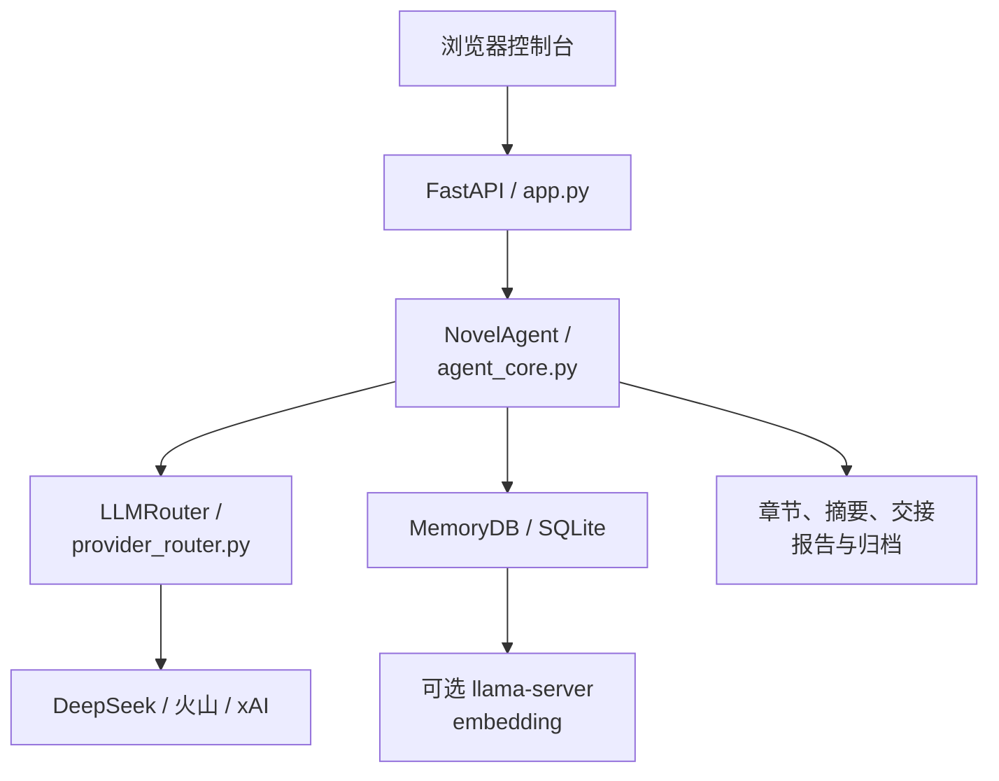
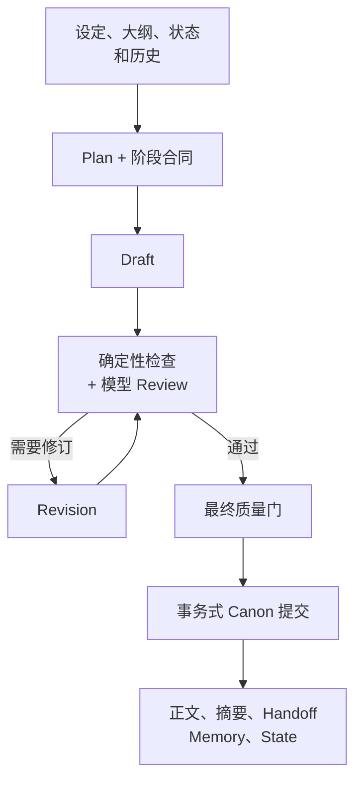

# NovelAgent 架构说明

[English](ARCHITECTURE_EN.md) · [返回 README](../README.md)

## 1. 总体结构

Web 层只负责认证、参数校验、状态接口、文件导出和 SSE 事件流。章节生成、审查、修订、审计、回滚与外部 Canon 导入都由 `NovelAgent` 管理。模型访问统一经过 `LLMRouter`，核心逻辑不直接持有明文密钥。

## 2. 章节生产流水线

关键约束：

- Plan 先生成当前章的进入状态、变化、切点和带出状态。
- Draft 使用最近正文、相关记忆、结构化 Canon 账本和章节边界交接。
- Review 同时接收模型结论与本地确定性检查结果。
- Revision 后必须重新经过最终质量门，不能直接覆盖 Canon。
- 正文、摘要、交接、记忆和状态作为一个 Canon bundle 提交；中途失败不会留下半章状态。

## 3. 核心模块

| 文件 | 责任 |
| --- | --- |
| `app.py` | FastAPI 应用、认证中间件、REST/SSE 接口、配置迁移、导出 |
| `agent_core.py` | Canon 生成、质量门、审计修复、回滚、DLC、读者版与事务协调 |
| `provider_router.py` | 模型路由、流式请求、重试、取消、用量与费用元数据 |
| `memory_db.py` | SQLite schema、长期记忆、FTS、向量相似度、用量记录 |
| `continuity.py` | Handoff 规范化、相邻章节边界和确定性连续性检查 |
| `canon_guard.py` | Canon 账本、状态约束与提交前校验 |
| `external_canon.py` | 外部章节 ZIP 校验、范围锁定、哈希和清单验证 |
| `md_manager.py` | `story/*.md` 的受限解析、预览、diff 与原子写入 |
| `embedding_manager.py` | 可选本地 embedding 服务的启动、停止和健康检查 |
| `auth_manager.py` | PBKDF2 口令校验、会话和登录限速 |
| `secret_store.py` | Windows DPAPI 与非 Windows 环境变量密钥读取 |

## 4. 数据布局

| 路径 | 内容 | 是否应提交 |
| --- | --- | --- |
| `story/` | 作者维护的前提、世界观、人物、大纲和风格 | 仅提交无隐私的模板或公开项目数据 |
| `prompts/` | 可编辑的流程提示词与 DLC 参考 | 是，但先检查内容 |
| `chapters/` | 已确认 Canon 正文与候选 | 否 |
| `plans/`, `reviews/` | 阶段输出 | 否 |
| `summaries/`, `handoffs/` | 跨章压缩状态 | 否 |
| `novel_memory.sqlite3` | 正文、记忆、用量和 embedding | 否 |
| `runtime/`, `logs/` | 密钥、认证、缓存、PID 与日志 | 否 |
| `reports/`, `archive/` | 审计报告、修复批次与回滚归档 | 否 |

## 5. 一致性与恢复设计

- `continuity.py` 检查相邻章时间、地点、物品、知识和未完成动作。
- `canon_guard.py` 将人物状态、关系、物品、地点、知识与事件整理成结构化账本。
- 每章结束后保存 Handoff 和状态快照，下一章不只依赖自然语言摘要。
- 审计修复先生成候选，再进行局部与联合复核；只有显式提交后才覆盖正文。
- 重写和修复提交前创建归档，并用哈希识别提交后的漂移，避免回滚覆盖后来人工修改。

## 6. 安全边界

- API Key 不进入 `config.json`；配置只保存密钥文件路径。
- Windows 使用当前用户 DPAPI。非 Windows 只从环境变量读取，不落盘伪加密。
- 登录密码只保存 PBKDF2-HMAC-SHA256 盐化散列。
- 修改类接口经过会话认证和同源检查。
- 外部 ZIP 有文件名、范围、单文件大小、总大小与哈希校验。
- 公开版已完全移除 AIDA64、BMC、IPMI、传感器轮询和功耗控制调用链。
