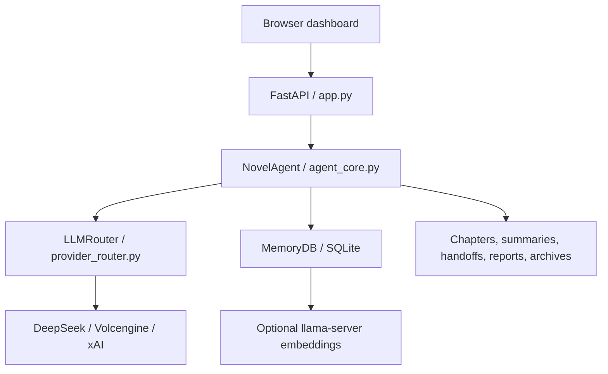
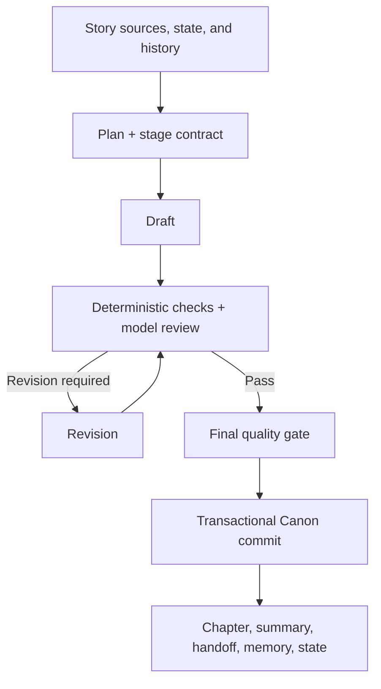

# NovelAgent Architecture

[中文](ARCHITECTURE.md) · [Back to README](../README_EN.md)

## 1. System overview

The web layer handles authentication, request validation, status endpoints, exports, and Server-Sent Events. `NovelAgent` owns generation, review, revision, auditing, rollback, and external canonical imports. All model traffic goes through `LLMRouter`; core logic does not hold plaintext credentials.

## 2. Chapter pipeline

Important properties:

- Planning establishes entry state, chapter change, cut point, and carry-out state.
- Drafting receives recent full text, relevant memories, a structured canonical ledger, and chapter-boundary handoff data.
- Review combines model judgment with local deterministic checks.
- Revised text must pass a fresh final gate before replacing Canon.
- Chapter, summary, handoff, memories, and state are committed as one bundle so a failed run does not leave a partial chapter state.

## 3. Main modules

| File | Responsibility |
| --- | --- |
| `app.py` | FastAPI app, authentication middleware, REST/SSE API, config migration, exports |
| `agent_core.py` | Canon pipeline, quality gates, audit/repair, rollback, DLC, reader reflow, transactions |
| `provider_router.py` | Provider routing, streaming, retries, cancellation, usage and cost metadata |
| `memory_db.py` | SQLite schema, long-term memory, FTS, vector similarity, usage records |
| `continuity.py` | Handoff normalization and deterministic adjacent-chapter checks |
| `canon_guard.py` | Canon ledger, state constraints, and pre-commit validation |
| `external_canon.py` | External ZIP validation, range locks, hashes, and manifests |
| `md_manager.py` | Restricted parse, preview, diff, and atomic writes for `story/*.md` |
| `embedding_manager.py` | Optional local embedding server lifecycle and health checks |
| `auth_manager.py` | PBKDF2 password verification, sessions, and login throttling |
| `secret_store.py` | Windows DPAPI and non-Windows environment-variable secrets |

## 4. Data layout

| Path | Contents | Commit? |
| --- | --- | --- |
| `story/` | Premise, world, characters, outline, style | Only public templates or intentionally public project data |
| `prompts/` | Editable pipeline prompts and DLC reference | Yes, after review |
| `chapters/` | Canon text and candidates | No |
| `plans/`, `reviews/` | Intermediate stage output | No |
| `summaries/`, `handoffs/` | Compressed cross-chapter state | No |
| `novel_memory.sqlite3` | Chapters, memory, usage, embeddings | No |
| `runtime/`, `logs/` | Secrets, authentication, caches, PIDs, logs | No |
| `reports/`, `archive/` | Audit reports, repair batches, rollback archives | No |

## 5. Continuity and recovery

- `continuity.py` checks adjacent chapters for time, place, objects, knowledge, and unfinished actions.
- `canon_guard.py` turns character, relationship, item, location, knowledge, and event state into a structured ledger.
- Every completed chapter writes a handoff and state snapshot, so the next chapter does not depend on summaries alone.
- Audit repair creates candidates first, then performs local and joint review; text changes only after an explicit commit.
- Rewrites and repair commits create archives and use hashes to detect later manual changes before rollback.

## 6. Security boundaries

- API keys are not stored in `config.json`; it contains secret-file references only.
- Windows uses current-user DPAPI. Non-Windows systems read environment variables and do not persist weakly obfuscated substitutes.
- Login passwords are stored as salted PBKDF2-HMAC-SHA256 hashes.
- Mutating endpoints require an authenticated session and same-origin validation.
- External ZIP imports validate names, ranges, individual sizes, total size, and hashes.
- The public release removes the complete AIDA64, BMC, IPMI, sensor polling, and power-control call chain.
